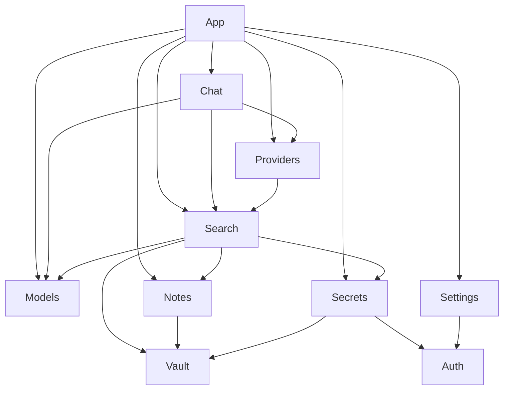

# Note Secret Search v0.2.0 Phase 8：架构收敛与 UI 稳定化

## 基线与 Checkpoint

- 固定基线：`edee9f48ec7858393e99a41014a34159b31139fb`。Phase 3/4/5/6/7 worktree 已复核干净，Phase 7 `git diff --check` 通过。
- Phase 8 分支及 worktree 当前尚未创建。首个执行动作固定为从该提交创建 `codex/repair-phase-8` 和 `E:\Archive\Flutter\worktrees\note_secret_search-repair-phase-8`。
- 随后将本计划原样保存至 `docs/superpowers/plans/2026-07-26-note-secret-search-v0-2-phase-8-architecture-ui-stabilization.md`，提交为 `docs: add phase 8 architecture stabilization plan`，再次运行 `git diff --check`，汇报 worktree、HEAD、计划路径、提交号、关键缺陷和顺序后停止。
- 生产代码实施需要计划提交后的下一次明确确认。主工作树及 Phase 3 至 Phase 7 worktree保持原样。
- 排除项：数据库 schema、Gradle、AAR、native runtime、catalog assets、MiniCPM/mtmd、CI、发布、版本号、同步功能和远程 catalog。Huawei 设备门禁保持待执行状态。

## 缺陷证据

- 文件级 SCC 共 3 个：`model_selection_providers.dart:5-10` ↔ `search_providers.dart:3-9` ↔ `search_index_settings_providers.dart:4-5`；`bootstrap_provider.dart:22` ↔ `security_settings_providers.dart:2`；`model_download_providers.dart:9-30` ↔ `llm_runtime_providers.dart:7`。
- `core/storage/migration/legacy_security_migration_orchestrator.dart:6-7` 反向导入 auth feature；各 feature application provider 又在本层创建 SQLite、Dio、filesystem、MethodChannel 和 SharedPreferences adapter。
- 保存与删除编排位于 `note_editor_page.dart:123-174`、`note_detail_page.dart:65-84`、`secret_editor_page.dart:139-192`、`secret_detail_page.dart:65-84`。
- 索引刷新重复于 `search_page.dart:190-207,637-650` 和 `search_settings_page.dart:27-60,190-260,352-376,564-581`。
- 模型下载、修复、删除和激活位于 `model_management_page.dart:176-289`、`model_management_catalog_entry.dart:103-141,292-387`；聊天 restore/send/session 选择位于 `free_chat_tab.dart:14-40`、`private_qa_tab.dart:13-44`、`ai_chat_page.dart:68-79,194-230`。
- 没有字面 `.value!`；实际异步缺陷是 `security_settings_providers.dart:18-23` 在 loading/error 时读取 `.value` 后抛错，以及 settings controller 用 defaults 覆盖尚未加载的状态。模型页多处 `valueOrNull` 将 loading/error 伪装为空列表或未启用。
- 路由字面量散布在 24 个调用点；`search_settings_page.dart:59` 指向未注册 `/`。router 和 `AppLockGate:39-112` 同时重定向至 `/vault`，导致原始 URI、query 和 back stack 丢失。
- 定义无引用：四个 `in_memory_*_repository.dart` / `placeholder_embedding_engine.dart`。零 package import 的直接依赖为 `freezed_annotation`、`json_annotation`、`collection`、`meta`、`local_auth`、`flutter_secure_storage`、`package_info_plus`、`device_info_plus`，以及三个 codegen dev dependencies。
- 当前超限清单为 10 个生产文件和 24 个测试文件，共 34 个。测试含 30 处固定滚动、11 处超大 physical viewport、18 处固定 surface、9 处固定时长 pump，以及位置型 `.first/.last` 控件选择。
- 过期材料包括搜索“占位语义”文案、模型签名和真实下载尚未完成的声明、SyncAdapter/WebDAV 占位项、两个旧 native/lifecycle 计划，以及 Phase 7 计划第 80 行把 mtmd/MiniCPM 错误分配给 Phase 8。

## 目标依赖图与所有权

- `app/composition` 成为唯一 composition root，使用 Riverpod overrides 构造所有 concrete adapters 和跨 feature adapters；feature application 只声明依赖 token、用例及投影 provider。
- `core`、domain 和 feature application 禁止导入 `app`、presentation 或 concrete infrastructure；`core` 禁止导入 feature。application controller 不再保存原始 `Ref`。
- SharedPreferences 变为 app-private provider；模型选择、外部 consent、安全设置分别通过 feature-owned store/repository interface 访问。
- `SensitiveStateInvalidator` 保持 app-owned，因为它是明确的跨 feature composition 行为；feature 只暴露 `clear/reset` 接口。

## 用例接口与行为不变量

| 模块 | 新接口 | 固定行为 |
|---|---|---|
| 内容 | `SaveNoteUseCase.execute`、`DeleteNoteUseCase.execute`、`SaveSecretUseCase.execute`、`DeleteSecretUseCase.execute` | 保持 mapper/加密、repository transaction、成功后 projection 刷新；仅在 active embedding 且 auto-index 开启时索引；失败或无默认 vault 时不退出页面。 |
| 搜索 | `RefreshSearchIndexUseCase.execute(query)`、`SearchSettingsUseCase.saveScope/saveIndexSettings`、单一 `SearchRefreshController` | 保持 lock-epoch 中止、write fence、before/after feedback、handoff 成功清除/失败保留；四个 transient StateProvider 合并为一个状态。 |
| 模型 | `ModelActivationUseCase.setEmbedding/setLocalLlm`、`ModelMaintenanceUseCase.start/pause/delete/revalidate/repair`、`ModelRuntimeCoordinator` | embedding 切换继续先 fence、release 旧 session、再持久化；download、repair、atomic install、runtime validation 和 Phase 7 session release 顺序不变。 |
| 聊天 | `ChatSessionCoordinator.restoreLatest/startNew/select/send/stop/resetForLock`；`AiChatOrchestrator` 改为构造注入 | 合并五个 selection StateProvider；保持 local 无静默 fallback、external fingerprint consent、private projection、持久化顺序、取消与 stale generation 防护。 |
| 安全 | 同步提供 lazy `SecuritySettingsRepository`，controller 显式表示 loading/error | 操作仅接受已加载 settings；PIN 策略常量移入 auth domain；PIN 页面不再等待 repository provider readiness。 |
| 导航 | `AppDestination` URI builders、`LockRouteGuard`、`PostUnlockNavigation` | router 单独拥有 redirect；保存完整受保护 URI，解锁后恢复；PIN reset 优先且保留原目标；无栈设置页返回 `/search`。 |

## RED → GREEN 切片与提交

1. 为现有保存、删除、索引、模型、聊天、锁定路由和 839/840 px 布局补 characterization tests；加入 import-graph 解析器并确认三个 SCC。提交：`test: characterize phase 8 architecture and ui workflows`。
2. RED 验证 feature→app、core→feature 和 concrete-adapter 泄漏；GREEN 建立 app composition overrides、移动 legacy security orchestrator、迁移 feature dependency tokens。提交：`refactor(app): establish acyclic provider composition`。
3. RED 覆盖 settings loading/error/dispose、consent/client routing；GREEN 引入 lazy stores，移除 `effectiveSearchPolicyProvider`、`externalProviderClientProvider` 和异步 `.value` 路径。提交：`fix(settings): make async provider readiness explicit`。
4. RED 覆盖 refresh 成功、失败、lock race、handoff；GREEN 引入搜索用例和单一 refresh state。提交：`refactor(search): centralize refresh and settings orchestration`。
5. RED 固化四个内容 mutation 工作流；GREEN 将保存、删除及条件索引移入用例。提交：`refactor(content): move mutations out of widgets`。
6. RED 固化模型激活、自愈、runtime validation、replace/delete release 顺序；GREEN 注入 `ModelRuntimeCoordinator` 并移除 ai_models→search/ai_chat 依赖。提交：`refactor(ai): isolate model runtime and activation orchestration`。
7. RED 固化 restore/new/select/send/cancel/privacy races；GREEN 引入 `ChatSessionCoordinator`，移除 `chatSessionControllerProvider` 和五个分散 selection providers。提交：`refactor(chat): centralize conversation session orchestration`。
8. RED 覆盖受保护 deep link、query、PIN reset、back stack；GREEN 集中 route builders 和 lock redirect ownership。提交：`refactor(navigation): restore protected destinations after unlock`。
9. 在 characterization 全绿后按下列清单拆分生产及测试文件，保持 private symbol 位于同一 Dart library。提交：`refactor: split oversized phase 8 modules`、`test: split oversized phase 8 suites`。
10. 删除四个 dead adapters，移除 11 个直接依赖并运行一次 `flutter pub get` 更新 lockfile/registrant。提交：`chore: remove unused repositories and dependencies`。
11. 更新文案、删除两个旧计划、修正 Phase 7 MiniCPM 延期归属；最终 gate 后勾选主路线图 Phase 8。提交：`docs: align product claims with phase 8 implementation`。
12. 将 architecture 和 file-size gate 收紧为零 SCC、零 allowlist。提交：`test: enforce phase 8 architecture and file size gates`。

## 逐文件拆分

- 生产：`search_page.dart` → page/status/result/observability parts；`search_settings_page.dart` → shell/index/readiness/scope/impact parts。
- 生产：`model_catalog_trust.dart` → verifier/canonicalizer/strict-json/ed25519 parts；`search_result_explanation.dart` → card/observability/pipeline parts。
- 生产：`io_model_revision_store.dart` → staging/install/path-safety parts；`model_catalog_entry.dart` → entry/artifact/source/parsing parts。
- 生产：`model_download_structured.dart` → operation/artifact-staging parts；`model_download_providers.dart` → root/legacy-command parts。
- 生产：`search_index_service.dart` → root/status/write parts；`semantic_search_service.dart` → root/scoring parts并沿用 paging part。每个物理文件目标不超过 450 行。
- 测试：`database_schema_v5_end_to_end_test.dart` → upgrade/fixture；`legacy_database_migrator_test.dart` → success/rejection/fakes；`legacy_security_migration_orchestrator_test.dart` → order/resume/fakes。
- 测试：`ai_chat_providers_test.dart` → backend/context/persistence/history/fakes；`ai_chat_sensitive_reset_test.dart` → lock-reset/stale-operation；`chat_session_providers_test.dart` → repository/selection/fakes。
- 测试：`ai_chat_orchestration_test.dart` → readiness/external-confirmation/harness；`ai_chat_page_test.dart` → responsive-route/session-panel/send-privacy/harness。
- 测试：`model_download_providers_test.dart` → runtime/resume-adoption/failover/integrity-repair/fakes；`model_selection_providers_test.dart` → embedding/llm/fakes；`model_download_service_test.dart` → fresh/resume-validator/restart-error。
- 测试：`model_management_page_test.dart` → summary-catalog/download-state/download-action/integrity/trust-copy/activation/harness；`ai_provider_providers_test.dart` → status/consent/settings/fakes。
- 测试：`security_orchestrator_test.dart` → bootstrap-migration/unlock-order/race-failure/lock-cleanup/fakes；`native_security_bridge_test.dart` → state-decode/unlock-decode/operations/migration-path/fakes；`app_lock_gate_test.dart` → provision-migration/lifecycle-shield/routing-pin/harness。
- 测试：`search_index_service_v6_test.dart` → generation/batching/fakes；`semantic_search_service_test.dart` → ranking/scope-corruption/paging/fakes；`sqlite_embedding_repository_test.dart` → replace-read/purge/fixture。
- 测试：`search_index_pipeline_integration_test.dart` → cases/fixture；`search_page_test.dart` → entry-empty/status-refresh/explanation-observability/result-navigation/handoff-feedback/harness。
- 测试：`search_result_explanation_test.dart` → card/observability/pipeline/fixtures；`search_settings_page_test.dart` → status/impact-save/guidance-model/refresh-handoff/harness；`sqlite_secret_repository_test.dart` → persistence-validation/transaction/fixture。
- 所有 case/support 文件使用 `_cases.dart`、`_fixture.dart` 或 `_harness.dart`，避免被测试运行器识别为独立入口；生成文件才允许排除于 500 行 gate。

## UI 测试稳定化

- 新建共享 helpers：`pumpRouteAtViewport`、`reveal`、`revealAndTap`、`pumpUntilFound`、`pumpUntilProviderSettled`。滚动按目标语义和 viewport 比例进行，异步等待按 predicate/provider 状态收敛。
- 控件通过 key、tooltip、语义标签或祖先关系定位；交互选择器中的位置型 `.first/.last`、固定滚动距离、固定 50/100/350ms pump 和人为 800×1600/1000×1600 viewport 全部移除。
- Matrix：`360×640 @1.3`、`393×852 @1.0`、`393×852 @2.0`、`839×800 @1.0`、`840×800 @1.0`、`1280×800 @1.0`。839/840 仅用于真实聊天 breakpoint；其余断言保持 viewport-independent。
- 关键语义场景：内容保存/删除、索引刷新与 handoff、模型动作及 loading/error、会话 restore/select/send、外部确认、锁定 deep link 恢复、长文本无 overflow。

## 文档与声明

- 搜索文案改为“本地语义索引/语义匹配”；外部访问提示改为当前已实现的开关加逐次授权语义。
- 模型说明准确描述 signed catalog、独立 checksum、resume/failover、atomic install、runtime validation 和设备建议；空任务文案改为“尚未创建下载任务”。
- 移除设置页 SyncAdapter/WebDAV 占位项，删除 `docs/android_native_bridge_plan.md` 和 `docs/app_lock_lifecycle_plan.md`。
- 修正 Phase 7 计划第 80 行：mtmd/MiniCPM 仍隐藏且位于 Phase 8 范围之外，需要独立授权阶段。

## 门禁与继续锚点

- 每个切片仅运行对应 architecture/application/widget focused tests及 `git diff --check`；逻辑簇完成后运行受影响 feature broader tests。
- 最终统一运行一次：`flutter analyze --no-pub`、全量 Dart tests、Android JVM tests、instrumentation Kotlin 编译、debug APK、依赖图/文件大小、敏感日志、隔离检查、Phase 5 ORT、Phase 6 AAR provenance/hash、APK/AAR ABI 与 MiniCPM hidden gate。
- AAR SHA-256 必须保持 `9583871b4179ae48ce3c57796fad21580167de4183ca6c28efdc2ed4724f9b41`；Gradle 使用 `E:\Archive\Flutter\gradle-cache-phase6-clean`。相关输入未变化时不重建 AAR，也不重复 APK/ORT/全量门禁。
- Phase 5/6/7 的 runtime、privacy、catalog、download、registry、atomic install、session lifecycle、ABI 和日志契约全部作为回归断言保留。
- Huawei SPN-AL00 API 29 只有在用户明确说明设备已连接后执行一次；此前不运行任何设备枚举或替代设备检查。
- 每次状态摘要记录 worktree、branch、HEAD、已完成切片、focused tests、未解决 RED、昂贵 gate ledger、AAR hash 和设备待执行状态。上下文压缩后以当前 Phase 8 HEAD、本计划和最近摘要继续，不重新探索或重复已通过门禁。
- 默认无文件大小暂缓项；若实现中出现生成文件以外的例外，先暂停并取得单独确认。
