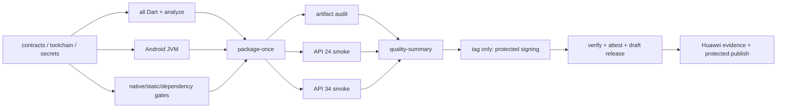

# Note Secret Search v0.2.0 Phase 9：CI、发布与版本就绪

## 摘要

Phase 9 严格落实主路线图第 130–138 行：补齐发布级集成覆盖、API 24/API 34 烟测、CI 与本地门禁一致性、单次 Android 打包与 artifact 复用、签名及 provenance、版本统一、发布文档和最终发布阻断条件。Phase 8 架构、MiniCPM/mtmd、远程 catalog、同步和新产品能力均不进入本阶段。

## Checkpoint A：只提交计划

1. 设 `$P8=E:\Archive\Flutter\worktrees\note_secret_search-repair-phase-8`、`$P9=E:\Archive\Flutter\worktrees\note_secret_search-repair-phase-9`，复核 `$P8` 为 `codex/repair-phase-8`、HEAD `2ff2db620a787cffdec1612298cb8b0ccb2b5f9c`、状态 clean，并确认 Phase 3–8 worktree均 clean。
2. 执行 `git worktree add -b codex/repair-phase-9 "$P9" 2ff2db6`；不修改主工作树及其中的 `.agents/`、`.codex/`、`AGENTS.md`、用户代码和未跟踪主路线图。
3. 将本计划原样写入 `docs/superpowers/plans/2026-08-05-note-secret-search-v0-2-phase-9-ci-release-version-readiness.md`。
4. 仅提交该文件：`git add -- <计划路径>`，`git commit -m "docs: add phase 9 release readiness plan"`。
5. 执行 `git diff --check`、`git status --short`，汇报 worktree、branch、HEAD、计划路径、计划提交号、关键缺陷、实施顺序、昂贵 gate 与复用策略，然后立即停止等待明确实施确认。

## 缺陷证据

- `.github/workflows/quality.yml:15-109` 在 migration 子集后再次运行全量 Dart，三个 job 重复 setup，只构建 debug APK；缺少 release APK/AAB、androidTest artifact、Phase 1–8 门禁、超时、显式 permissions、诊断上传和 retention。
- `scripts/quality/Invoke-QualityChecks.ps1:43-59` 只覆盖 analyze、全 Dart、JVM 和 debug APK，且硬编码 `gradlew.bat`/Windows 路径；CI 与本地并不等价。
- `Invoke-LlmAarProvenanceGate.ps1:11,63-70,421-443` 默认重建 AAR 两次；Phase 9 固定使用 `-SkipRebuild`。`Invoke-EmbeddingRuntimeDeviceGate.ps1:177-201` 自行重建 APK，破坏 artifact 复用。
- `pubspec.yaml:4` 为 `0.1.0+1`，`android/app/build.gradle.kts:16-17` 又硬编码 `1/0.1.0`；目标固定为 `0.2.0+2`、tag `v0.2.0`。
- `android/app/build.gradle.kts:21-25` 的 release 明确关闭 minify/resource shrink，但没有契约、release 构建或签名链路；`.gitignore:41-47` 未屏蔽 `*.jks`、`*.keystore`、`key.properties`。
- `external_provider_settings_page.dart:208-213,252-259` 与 `external_chat_gateway.dart:331-340` 未在系统边界限制 scheme/host；release 不得通过全局 cleartext 放开 HTTP。
- `note_detail_page.dart:243-252`、`secret_detail_page.dart:380-393` 直接写系统剪贴板；已持久化的 60 秒清理设置没有实际生效，也没有替换竞态和锁定清理。
- `README.md:33-38,62` 的工具链声明不完整并误称 CI 与本地一致；当前没有 CHANGELOG、发布说明、设备政策、威胁模型、known limitations 或发布账本。
- 已审计 debug APK 含三个 ABI、6 个 ORT 库、2 个 tokenizer asset、0 个 MiniCPM/mtmd/mmproj；`librnllama_v8.so` 仅 arm64，debug 额外含 Vulkan validation layer。AAR 仅含 arm64 runtime，SHA-256 固定为 `9583871b4179ae48ce3c57796fad21580167de4183ca6c28efdc2ed4724f9b41`。

复核命令固定使用 `rg -n` 定位上述行，使用 `flutter --version`、`dart --version`、`java -version`、`android\gradlew.bat --version` 验证工具链，使用 `Get-FileHash -Algorithm SHA256` 和 `jar tf` 验证 AAR/APK 内容；不得因此重新构建 AAR或 APK。

## 范围、接口与不变量

- 新增内部 `SecureClipboardGateway`/`SecureClipboardController`：复制时读取 `clipboardClearSeconds`，以 generation、timer 和当前剪贴板值比较避免清除后来替换的内容；锁定时 best-effort 立即清理，仅两个详情页改用该接口。
- 新增集中式 external endpoint policy：release 中所有外部 provider 必须 HTTPS；debug 仅可显式允许 loopback HTTP。UI 校验和 gateway 出口执行同一规则，release manifest不启用全局 cleartext。
- 不新增数据库 schema，不改 Phase 8 架构，不实现 MiniCPM/mtmd，不重建或替换 Phase 6 AAR，不扩大同步、catalog 或产品能力。
- v0.2.0 保持 Android R8、resource shrink 和 Flutter obfuscation关闭；由 contract 明确锁定。其理由是 JNI、反射和 native runtime 尚无 shrink/obfuscation characterization，本阶段不以混淆作为安全声明。
- 数据保存、锁定失败关闭、外部 AI逐次授权、privacy/catalog/download/registry/lifecycle 契约保持不变。

## 工具链与版本唯一所有权

| 项目 | 唯一 owner 与固定值 |
|---|---|
| 产品版本 | `pubspec.yaml`：`0.2.0+2`；Android 使用 `flutter.versionName/versionCode`；tag 必须为 `v0.2.0` |
| Flutter/Dart | 新增机器可读 Flutter pin `3.41.5`；Dart 随 Flutter并验证为 `3.11.3`，不建立独立安装版本 |
| Java/SDK/NDK | `android/gradle.properties` 持有 Java 17、compileSdk 36、targetSdk 34、minSdk 24、NDK `28.2.13676358`；Gradle和 CI读取同一值 |
| Gradle | wrapper properties：`8.11.1` |
| AGP/Kotlin | `android/settings.gradle.kts`：AGP `8.9.1`、Kotlin `2.2.20` |
| Artifact policy | 单一 JSON contract持有 AAR hash、ABI/native库规则、tokenizer/MiniCPM规则、manifest/permission和 release 优化策略 |

## 目标流水线与 Artifact Flow

- 建立 reusable quality workflow；普通 push/PR caller与 `v*` tag release caller调用同一 workflow。普通 run 可取消同 ref旧任务；tag/sign/publish禁止 cancellation。
- `package-once` 以一次 Gradle DAG运行 `:app:assembleDebug :app:assembleDebugAndroidTest :app:assembleRelease :app:bundleRelease --no-daemon --stacktrace`，上传 debug APK、androidTest APK、unsigned release APK/AAB、merged manifests和报告；下游不得调用 Flutter/Gradle build。
- artifact audit从同一下载包验证 SHA-256、版本、package、ABI、AAR、ORT、tokenizer、MiniCPM hidden、release无 Vulkan validation layer、manifest、permissions、exported components和 cleartext/backup/debuggable状态。
- API 24/API 34 使用同一 debug/androidTest artifact运行 instrumentation smoke，并对同一 unsigned release APK作临时 CI 签名后的 clean-install/cold-start/force-stop/relaunch；临时签名产物永不发布。
- provenance JSON记录 commit/ref/version、工具链、构建命令、输入 hash、artifact hash/size、ABI/native/assets、manifest和签名证书；PR artifact保留 7 天、失败诊断 14 天、release candidate 30 天，最终 release资产和 attestation随 Release长期保存。
- CI只缓存 Flutter/Pub/Gradle下载缓存，不缓存 build outputs、签名产物或重建 AAR；失败时始终上传测试报告、Gradle日志、merged manifests、audit/provenance JSON和 emulator logcat。

## 签名与 Secret Ownership

- 仓库只保存预期证书 SHA-256和签名契约；keystore、alias及密码仅属于受保护的 GitHub `release-signing` environment，写入 `$RUNNER_TEMP`、权限收紧、finally删除，任何值不得输出日志。
- release APK先 `zipalign` 后 `apksigner sign/verify --print-certs`；AAB使用 `jarsigner` sign/verify。签名前后比较非签名 ZIP entry manifest，证明没有重新构建或替换 payload。
- `v0.1.0` 公布的 `app-debug.apk` 证书 fingerprint是升级兼容基线；历史 signing key缺失或 candidate fingerprint不一致时阻断发布，不以要求用户卸载、丢失数据作为替代。
- workflow顶层仅 `contents: read`；签名/attestation/publish job按需提升 `contents: write`、`attestations: write`、`id-token: write`、`issues: read`，quality job不接收 release secrets。

## RED → GREEN → Refactor 与提交顺序

1. `test: characterize phase 9 release contracts`：先让版本漂移、CI DAG、artifact复用、release policy、secret ignore、manifest和文档缺失产生 RED。
2. `fix(security): clear sensitive clipboard data`：加入可注入 clipboard controller，覆盖超时、重复复制、外部替换、dispose和锁定竞态。
3. `fix(privacy): enforce secure external provider endpoints`：统一 UI/gateway endpoint policy，release拒绝 HTTP且不修改全局 cleartext。
4. `build: centralize v0.2.0 toolchain and version metadata`：更新为 `0.2.0+2`，Android委托 Flutter版本，集中工具链 owner并补 contract。
5. `refactor(ci): make quality gates portable and artifact-driven`：让 PowerShell脚本跨 Windows/Linux；provenance gate支持 `-SkipRebuild`；device gate接收现有 APK路径及 expected hash。
6. `test: add phase 9 integration and release smoke coverage`：用现有 Dart/SQLite分层覆盖 auth、migration、repositories、search、providers、lifecycle，只补实际跨边界缺口；新增 Android release smoke，不为目录命名重复已有全量场景。
7. `ci: package and audit Android artifacts once`：建立 reusable workflow、单次打包、artifact policy/provenance、dependency review、诊断和 retention。
8. `ci: add API 24 and API 34 release readiness smoke`：两个 emulator job只消费 package artifact。
9. `ci: add protected v0.2.0 signing and release flow`：签名、历史证书校验、attestation、draft release、人工 publish gate。
10. `docs: align v0.2.0 release claims and evidence`：更新 README，新增 CHANGELOG、release notes、支持设备政策、威胁模型、known limitations和 release ledger；明确 local LLM仅 arm64、MiniCPM/多模态未实现、HTTPS限制及硬件保护不作保证。
11. 每个提交前只运行受影响 focused tests和 `git diff --check`；characterization全绿后才整理重复 helper，所有生产/测试/脚本文件继续满足 500 行门禁。

## 验证与昂贵 Gate Ledger

- Focused：`flutter test <受影响测试文件>`、指定 Android `--tests`、release contract脚本及 `git diff --check`；不运行全量套件或构建。
- Broader：逻辑簇完成后运行对应 security/settings/provider/integration测试目录；migration、catalog、download、registry、search和 lifecycle 已由全量 Dart覆盖，不再单独重复。
- Final仅一次：`flutter analyze --no-pub`、全量 Dart、`:app:testDebugUnitTest`、单次 package DAG、AAR provenance `-SkipRebuild`、artifact/ABI/ORT/MiniCPM/tokenizer/privacy/manifest审计、API 24与API 34 smoke、签名验证和 attestation。
- package artifact以 `HEAD + pubspec.lock + Flutter pin + Gradle/AGP/Kotlin/SDK/NDK配置 + AAR/assets` 为缓存身份；身份未变时任何下游失败只重跑消费 job，不重建 APK/AAB/AAR。
- Phase 8 Huawei账本固定记录 `2ff2db6`、SPN-AL00/API29、BGE 3/3、两项 sensitive-log 1/1且 logcat clean。仅 CI、版本、签名、文档或 release-only配置变化时继续复用。
- runtime源、AAR、native packaging、ABI、tokenizer/assets、相关 instrumentation或依赖发生 material change才使 Phase 8设备证据失效；AAR变化须先单独确认。Phase 9最终只执行一次 signed release clean-install、v0.1.0 upgrade/data preservation、recovery和启动/logcat smoke，不重复 BGE native suites。

## 回滚、阻断与继续锚点

- 每个切片独立可回滚；CI、签名或文档失败先回滚对应提交，不回退既有安全/数据行为，不修改旧 worktree。
- 以下任一条件阻断 tag发布：非 clean HEAD、tag/version不一致、历史证书不匹配、AAR hash变化、artifact/ABI/ORT/MiniCPM/tokenizer/manifest/privacy gate失败、secret泄漏、release cleartext、未解决 P0/P1、无签名 Huawei升级/恢复证据、发布 claims超出实现。
- release先生成受保护的 signed candidate和 draft；人工 publish approval只在候选 artifact SHA与 Huawei证据完成核对后放行，不重新构建或重新签名。
- 上下文压缩后只以当前 Phase 9 HEAD、已提交计划、最近状态摘要、artifact/provenance hash和昂贵 gate ledger继续；不得因压缩重新探索、重建 AAR/APK或重跑已通过门禁。
